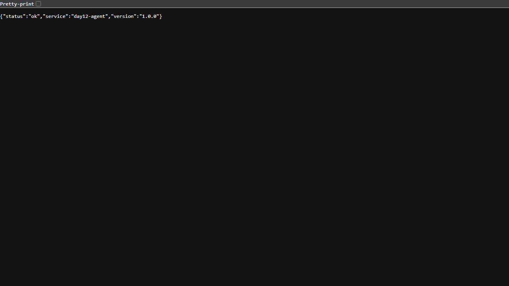

# Triển khai Cloud Run — Checkpoint 5

## Thông tin học viên

| Mục | Nội dung |
| --- | --- |
| Họ và tên | Bùi Tùng Dương |
| Mã học viên | 2A202602775 |
| Repo | https://github.com/bobui147/K4-L3A-DAY12-BuiTungDuong-2A202602775-CloudServicesAndDeployment |

## Service công khai

| Mục | Nội dung |
| --- | --- |
| Public URL | https://day12-agent-405248380835.asia-southeast1.run.app |
| Platform | Google Cloud Run |
| Project / vùng | `labcloud-510008` / `asia-southeast1` |
| Ngày deploy | 2026-09-28 |
| Redis | Memorystore Redis Basic 1 GiB, instance `day12-redis`, kết nối qua Direct VPC |
| Image | Artifact Registry `day12-agent/agent` |

## Biến môi trường và quyền

| Biến | Nguồn giá trị trên cloud |
| --- | --- |
| `PORT` | Cloud Run tự cấp |
| `AGENT_API_KEY` | Secret Manager `day12-agent-api-key:latest` |
| `REDIS_URL` | Secret Manager `day12-redis-url:latest` (địa chỉ nội bộ, không lưu trong repo hay GitHub Actions) |
| `RATE_LIMIT_PER_MINUTE` | Mặc định ứng dụng: `10` |
| `MONTHLY_BUDGET_USD` | Mặc định ứng dụng: `10.0` |
| `LOG_LEVEL` | Mặc định ứng dụng: `INFO` |

Runtime service account `day12-runtime` chỉ có quyền đọc hai secret tương ứng. Service `day12-agent` cho phép gọi công khai, nhưng `/ask` bắt buộc có `X-API-Key`. GitHub Actions dùng Workload Identity Federation giới hạn đúng repo và nhánh `main`; tài khoản deploy chỉ có quyền trên Artifact Registry repository, runtime service account và Cloud Run service này.

## Kết quả kiểm tra thật trên Public URL

```text
GET  /health  200  {"status":"ok","service":"day12-agent","version":"1.0.0"}
GET  /ready   200  {"status":"ready","redis":true}
POST /ask không có API key  401  {"detail":"invalid or missing API key"}
POST /ask có API key, X-User-Id=cloud-submission  200  (có answer, history_length=0)
15 lần POST /ask với cùng X-User-Id: 200 × 10, sau đó 429 × 5
```

Sau khi chuyển `REDIS_URL` sang Secret Manager, kiểm tra lại `/health` 200, `/ready` 200 và `/ask` có khóa 200.



## CI/CD và sự cố đã xử lý

[GitHub Actions run 36402569029](https://github.com/bobui147/K4-L3A-DAY12-BuiTungDuong-2A202602775-CloudServicesAndDeployment/actions/runs/36402569029) đã chạy thành công bước test và build. Workflow triển khai phiên bản mới lên Cloud Run sau khi hai bước này đạt, chỉ trên nhánh `main`.

Lần đầu bật `compute.googleapis.com`, Google Cloud trả `The service is currently being deactivated and deactivation must complete before activation can occur`. Tôi kiểm tra trạng thái API rồi chờ tác vụ vô hiệu hóa kết thúc; lần bật lại sau đó thành công. Sau khi kích hoạt `redis.googleapis.com`, tôi tạo Memorystore, triển khai Cloud Run và xác nhận Redis kết nối được qua `/ready`.
